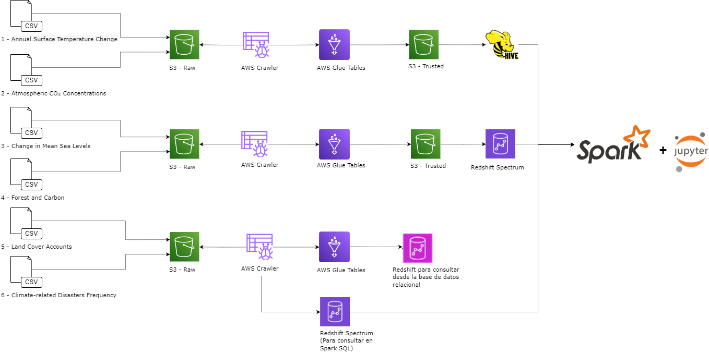

## TRABAJO-1_ST1800-20242
Este repositorio es la entrega del trabajo 1 de la clase de Almacenamiento y Recuperación de la Información (ST1800).
Los integrantes de este grupo son: 
- Laura Riveros
- Vivian Sánchez
- Maria del Rosario Castro Mantilla

## Contexto

Esta entrega busca profundizar el conocimiento de las arquitecturas de una solución big data de AWS. Para esto escogimos un caso particular sobre el cambio climático. 

Usaremos datos de la plataforma de cambio climático del Fondo Monetario Internacional. En específico, se realizará la ingesta, procesamiento y consulta de los siguientes datos:

## Fuentes de datos:
•[IMF - Annual Surface Temperature Change (TEMP_CHANGE)](https://services9.arcgis.com/weJ1QsnbMYJlCHdG/arcgis/rest/services/Indicator_3_1_Climate_Indicators_Annual_Mean_Global_Surface_Temperature/FeatureServer/0/query?where=1%3D1&outFields=*&outSR=4326&f=json)

•[IMF - Atmospheric CO₂ Concentrations (ATM_CON)](https://services9.arcgis.com/weJ1QsnbMYJlCHdG/arcgis/rest/services/Indicator_3_2_Climate_Indicators_Monthly_Atmospheric_Carbon_Dioxide_concentrations/FeatureServer/0/query?outFields=*&where=1%3D1&f=geojson)

•[IMF - Change in Mean Sea Levels (SEA_LVLS)](https://services9.arcgis.com/weJ1QsnbMYJlCHdG/arcgis/rest/services/Indicator_3_3_melted_new/FeatureServer/0/query?outFields=*&where=1%3D1&f=geojson)

•[IMF - Forest and Carbon (FOR_CARB)](https://services9.arcgis.com/weJ1QsnbMYJlCHdG/arcgis/rest/services/Indicator_3_5/FeatureServer/0/query?outFields=*&where=1%3D1&f=geojson)

•[IMF - Land Cover Accounts (LAND_COV)](https://services9.arcgis.com/weJ1QsnbMYJlCHdG/arcgis/rest/services/Indicator_3_4/FeatureServer/0/query?outFields=*&where=1%3D1&f=geojson)

•[IMF - Climate-related Disasters Frequency (CLIM_DIS)](https://services9.arcgis.com/weJ1QsnbMYJlCHdG/arcgis/rest/services/Indicator_11_1_Physical_Risks_Climate_related_disasters_frequency/FeatureServer/0/query?outFields=*&where=1%3D1&f=geojson)

## Ingesta de datos:
El consumo de los datos desde las URLs se realizará a través de las APIs que facilita IMF. A través de Python accederemos a ellas con las librerías boto3, json y request (para el procedimiento de API Rest). Luego, convertiremos nuestros datos a formato CSV, para finalizar con la vinculación a un Bucket en S3 de AWS

## Arquitectura y Componentes para la Solución:

**1. S3:** En este servicio almacenaremos en Buckets la información de la zona Raw, donde encontraremos los datos en CSV, y así mismo hacia la zona TRUSTED, en donde tendremos la info procesada y lista para consulta, con la información lista para utilizarse por los otros sistemas

•	Raw: "arn:aws:s3:::rawtrabajo1"

•	Trusted: "arn:aws:s3:::trustedtrabajo1"

**2. AWS Glue Crawlers:** Generar un diccionario de los datos de la zona RAW que se encuentran en S3

**3. HDFS Hive:** Este servicio de Hadoop se usa para realizar consultas desde HIVE y desde el notebook con Spark SQL

**4. Redshift Spectrum:** Realizar consultas desde la zona Trusted desde HIVE o el notebook de Spark SQL

**5. Redshift:** Este servicio es útil para el almacenamiento de bases relacionales.

**6. Spark/Jupyter:** Desde este notebook podremos consultar y explorar los datos finales para la toma de decisiones de negocio


### Explicación de la Estructura

1. **`README.md`**: Proporciona el contexto, la fuente de los datos y los componentes de la solución.
2. **`ARQUITECTURA.drawio.png`**: Contiene el diagrama de arquitectura de la solución.
3. **`1 ETL Python Raw S3`**: Contiene scripts Python para realizar ETL en la zona RAW utilizando AWS Glue.
4. **`2 AWS Glue`**: Catalogación AWS Glue hacia la zona Trusted.
5. **`3 AWS S3 TRUSTED`**: datos depurados en la zona Trusted.
6. **`4 Redshift`**: Scripts SQL para la creación de tablas.
7. **`5 Consultas SQL`**: Consultas SQL para realizar análisis en Redshift Spectrum y Hive.
8. **`0 Notebook`**: Notebooks pySpark para la explotación de datos en EMR.

Esta estructura proporciona una visión clara del contenido del repositorio y facilita la navegación y comprensión del proyecto.

### Estructura del Repositorio
```
│   README.md                           # Contexto, fuente de los datos y componentes de la solución
|   ARQUITECTURA.drawing.png             # Diagrama de Arquitectura
│   
└───1 ETL Python Raw S3                 # AWS GLUE hacia zona RAW
|   | ETL_TEMP_CHANGE.ipynb             # ETL Cambio de temperatura global
|   | ETL_ATM_CON.py                    # ETL Concentración de carbono en la atmósfera 
|   | ETL_SEA_LVLS.py                   # ETL Cambios en los niveles del mar
|   | ETL_FOR_CARB.py                   # ETL de bosques y carbono capturado
|   | ETL_LAND_COV.py                   # ETL cobertura de suelo
|   | ETL_CLIM_DIS.py                   # ETL frecuencias de desastres naturales
|   |
└───2 AWS Glue - CATALOGACIÓN           # AWS GLUE como catalogador
|   | End-points                        # Consumo de S3
|   | Crawlers                          # Crawlers de datos
|   | Tablas                            # Crawlers de datos
└───3 AWS S3 TRUSTED                    # Almacenamiento zona Trusted
|   | trusted zone                      # De esta zona es que se consumen los datos para realizar consultas
└───4 Redshift                          # Creación de tabla externa en Redshift
|   | Creación de tablas              
└───5 Consultas SQL                     # Ej Consultas en HIVE, Redshift Spectrum
|   | 1 Redshift Spectrum.sql           # Consulta Redshift Spectrum
|   | 2 Hive.sql                        # Consulta Hive
|   |
└───0 Notebook                          # Notebook pySpark EMR
|   | SPARK - JUPYTER.ipynb             # Notebook
|   | ETL_ATM_CON_PROCESS.ipynb         # Notebook
|   | ETL_CLIM_DIS_PROCESS.ipynb        # Notebook
|   | ETL_FOR_CARB_PROCESS.ipynb        # Notebook
|   | ETL_LAND_COV_PROCESS.ipynb        # Notebook
|   | ETL_SEA_LVLS_PROCESS.ipynb        # Notebook
|   | ETL_TEMP_CHANGE_PROCESS.ipynb     # Notebook
```
