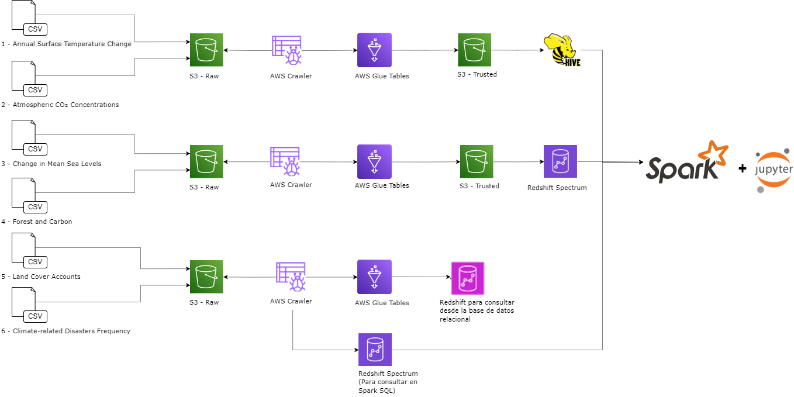

#**TRABAJO-1_ST1800-20242**
Este repositorio es la entrega del trabajo 1 de la clase de Almacenamiento y Recuperación de la Información (ST1800).

# Contexto

Esta entrega busca profundizar el conocimiento de las arquitecturas de una solución big data de AWS. Para esto escogimos un caso particular sobre el cambio climático. 

Usaremos datos de la plataforma de cambio climático del Fondo Monetario Internacional. En específico, se realizará la ingesta, procesamiento y consulta de los siguientes datos:

## Fuentes de datos:
•[IMF - Annual Surface Temperature Change (TEMP_CHANGE)](https://services9.arcgis.com/weJ1QsnbMYJlCHdG/arcgis/rest/services/Indicator_3_1_Climate_Indicators_Annual_Mean_Global_Surface_Temperature/FeatureServer/0/query?where=1%3D1&outFields=*&outSR=4326&f=json)

•[IMF - Atmospheric CO₂ Concentrations (ATM_CON)](https://services9.arcgis.com/weJ1QsnbMYJlCHdG/arcgis/rest/services/Indicator_3_2_Climate_Indicators_Monthly_Atmospheric_Carbon_Dioxide_concentrations/FeatureServer/0/query?outFields=*&where=1%3D1&f=geojson)

•[IMF - Change in Mean Sea Levels (SEA_LVLS)](https://services9.arcgis.com/weJ1QsnbMYJlCHdG/arcgis/rest/services/Indicator_3_3_melted_new/FeatureServer/0/query?outFields=*&where=1%3D1&f=geojson)

•[IMF - Forest and Carbon (FOR_CARB)](https://services9.arcgis.com/weJ1QsnbMYJlCHdG/arcgis/rest/services/Indicator_3_5/FeatureServer/0/query?outFields=*&where=1%3D1&f=geojson)

•[IMF - Land Cover Accounts (LAND_COV)](https://services9.arcgis.com/weJ1QsnbMYJlCHdG/arcgis/rest/services/Indicator_3_4/FeatureServer/0/query?outFields=*&where=1%3D1&f=geojson)

•[IMF - Climate-related Disasters Frequency (CLIM_DIS)](https://services9.arcgis.com/weJ1QsnbMYJlCHdG/arcgis/rest/services/Indicator_11_1_Physical_Risks_Climate_related_disasters_frequency/FeatureServer/0/query?outFields=*&where=1%3D1&f=geojson)

##**Ingesta de datos:**
El consumo de los datos desde las URLs se realizará a través de las APIs que facilita IMF. A través de Python accederemos a ellas con las librerías boto3, json y request (para el procedimiento de API Rest). Luego, convertiremos nuestros datos a formato CSV, para finalizar con la vinculación a un Bucket en S3 de AWS

## **Arquitectura y Componentes para la Solución**

1.	S3: En este servicio almacenaremos en Buckets la información de la zona RAW, donde encontraremos los datos en CSV, y así mismo hacia la zona TRUSTED, en donde tendremos la info procesada y lista para consulta, con la información lista para utilizarse por los otros sistemas

•	Raw: 

•	Trusted: 
